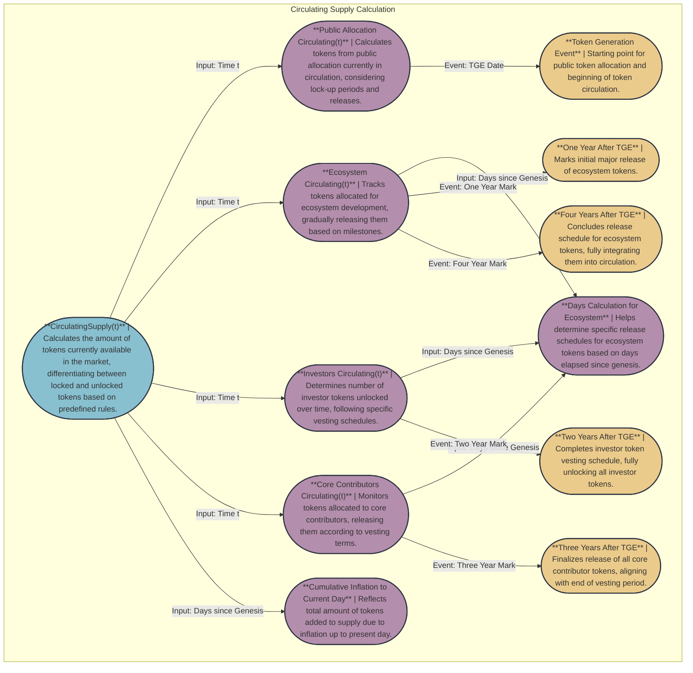
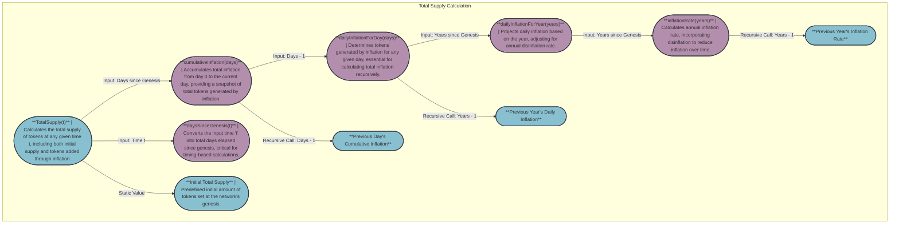

# Dataflow

## getCirculatingSupply

```mermaid
graph TB
    subgraph "Circulating Supply Calculation"
        style CirculatingSupply fill:#88c0d0, stroke:#2e3440, stroke-width:2px, shape:rect
        CirculatingSupply(["**CirculatingSupply(t)** | Calculates the amount of tokens currently available in the market, differentiating between locked and unlocked tokens based on predefined rules."]):::sameColor
        -->|"Input: Time t"| publicAllocationCirculating(["**Public Allocation Circulating(t)** | Calculates tokens from public allocation currently in circulation, considering lock-up periods and releases."]):::inputColor
        CirculatingSupply -->|"Input: Time t"| ecosystemCirculating(["**Ecosystem Circulating(t)** | Tracks tokens allocated for ecosystem development, gradually releasing them based on milestones."]):::inputColor
        CirculatingSupply -->|"Input: Time t"| investorsCirculating(["**Investors Circulating(t)** | Determines number of investor tokens unlocked over time, following specific vesting schedules."]):::inputColor
        CirculatingSupply -->|"Input: Time t"| coreContributorsCirculating(["**Core Contributors Circulating(t)** | Monitors tokens allocated to core contributors, releasing them according to vesting terms."]):::inputColor
        CirculatingSupply -->|"Input: Days since Genesis"| cumulativeInflation2(["**Cumulative Inflation to Current Day** | Reflects total amount of tokens added to supply due to inflation up to present day."]):::inputColor
        ecosystemCirculating -->|"Input: Days since Genesis"| daysSinceGenesis1(["**Days Calculation for Ecosystem** | Helps determine specific release schedules for ecosystem tokens based on days elapsed since genesis."]):::inputColor
        investorsCirculating -->|"Input: Days since Genesis"| daysSinceGenesis1:::inputColor
        coreContributorsCirculating -->|"Input: Days since Genesis"| daysSinceGenesis1:::inputColor
        ecosystemCirculating -->|"Event: One Year Mark"| oneYearAfterTGE(["**One Year After TGE** | Marks initial major release of ecosystem tokens."]):::eventColor
        ecosystemCirculating -->|"Event: Four Year Mark"| fourYearsAfterTGE(["**Four Years After TGE** | Concludes release schedule for ecosystem tokens, fully integrating them into circulation."]):::eventColor
        investorsCirculating -->|"Event: Two Year Mark"| twoYearsAfterTGE(["**Two Years After TGE** | Completes investor token vesting schedule, fully unlocking all investor tokens."]):::eventColor
        coreContributorsCirculating -->|"Event: Three Year Mark"| threeYearsAfterTGE(["**Three Years After TGE** | Finalizes release of all core contributor tokens, aligning with end of vesting period."]):::eventColor
        publicAllocationCirculating -->|"Event: TGE Date"| TGE(["**Token Generation Event** | Starting point for public token allocation and beginning of token circulation."]):::eventColor
    end
    classDef sameColor fill:#88c0d0,stroke:#2e3440,stroke-width:2px, shape:rect;
    classDef inputColor fill:#b48ead,stroke:#2e3440,stroke-width:2px, shape:rect;
    classDef eventColor fill:#ebcb8b,stroke:#2e3440,stroke-width:2px, shape:rect;

```

## getTotalSupply

```mermaid
graph TB
    subgraph "Total Supply Calculation"
        style TotalSupply fill:#88c0d0, stroke:#2e3440, stroke-width:2px, shape:rect
        TotalSupply(["**TotalSupply(t)** | Calculates the total supply of tokens at any given time t, including both initial supply and tokens added through inflation."]):::sameColor
        -->|"Input: Days since Genesis"| cumulativeInflation(["**cumulativeInflation(days)** | Accumulates total inflation from day 0 to the current day, providing a snapshot of total tokens generated by inflation."]):::inputColor
        TotalSupply -->|"Input: Time t"| daysSinceGenesis(["**daysSinceGenesis(t)** | Converts the input time 't' into total days elapsed since genesis, critical for timing-based calculations."]):::inputColor
        cumulativeInflation -->|"Input: Days - 1"| dailyInflationForDay(["**dailyInflationForDay(days)** | Determines tokens generated by inflation for any given day, essential for calculating total inflation recursively."]):::inputColor
        dailyInflationForDay -->|"Input: Years since Genesis"| dailyInflationForYear(["**dailyInflationForYear(years)** | Projects daily inflation based on the year, adjusting for annual disinflation rate."]):::inputColor
        dailyInflationForYear -->|"Input: Years since Genesis"| inflationRate(["**inflationRate(years)** | Calculates annual inflation rate, incorporating disinflation to reduce inflation over time."]):::inputColor
        cumulativeInflation -->|"Recursive Call: Days - 1"| cumulativeInflation1(["**Previous Day's Cumulative Inflation**"]):::sameColor
        dailyInflationForDay -->|"Recursive Call: Years - 1"| dailyInflationForYear1(["**Previous Year's Daily Inflation**"]):::sameColor
        inflationRate -->|"Recursive Call: Years - 1"| inflationRate1(["**Previous Year's Inflation Rate**"]):::sameColor
        TotalSupply -->|"Static Value"| initialTotalSupply(["**Initial Total Supply** | Predefined initial amount of tokens set at the network's genesis."]):::sameColor
    end
    classDef sameColor fill:#88c0d0,stroke:#2e3440,stroke-width:2px, shape:rect;
    classDef inputColor fill:#b48ead,stroke:#2e3440,stroke-width:2px, shape:rect;
    classDef eventColor fill:#ebcb8b,stroke:#2e3440,stroke-width:2px, shape:rect;

```